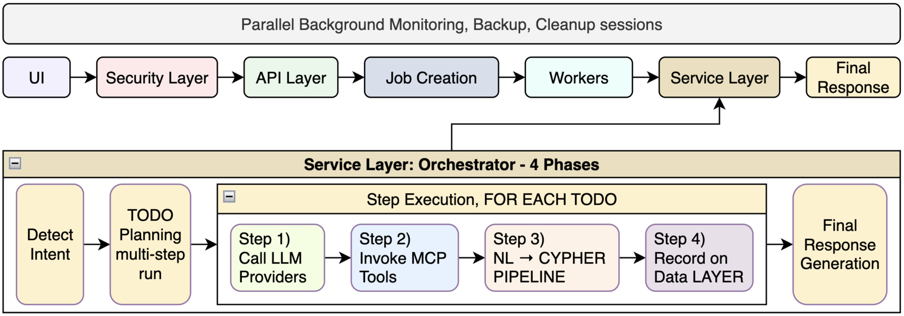
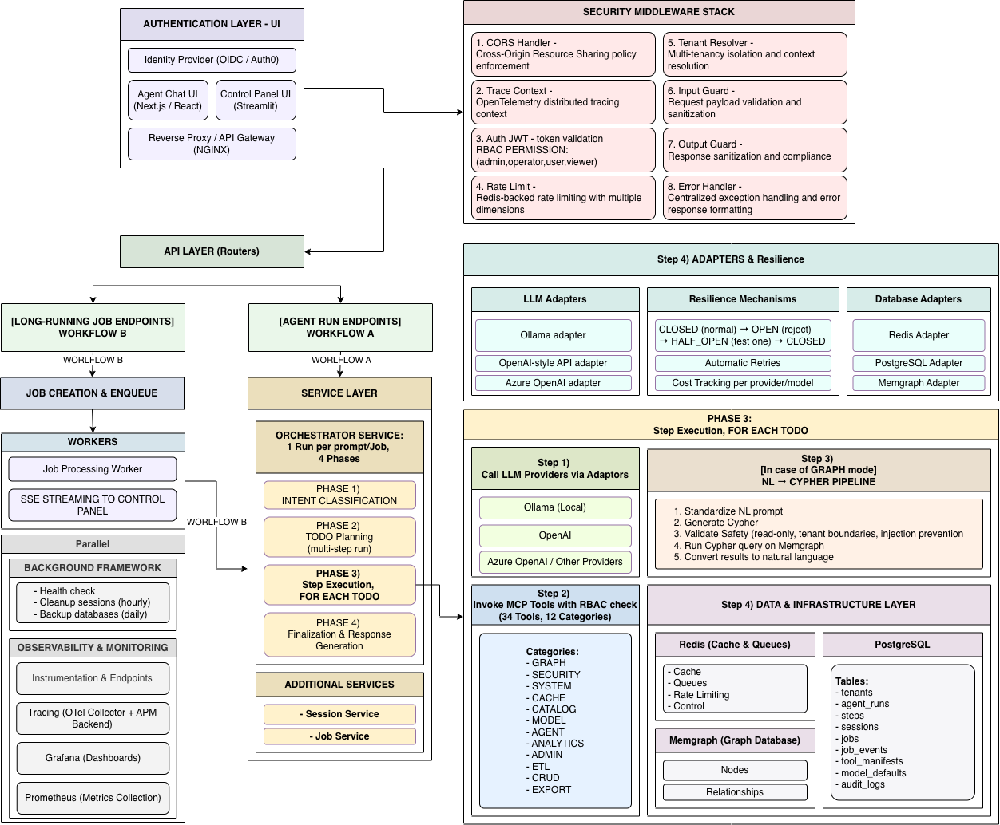
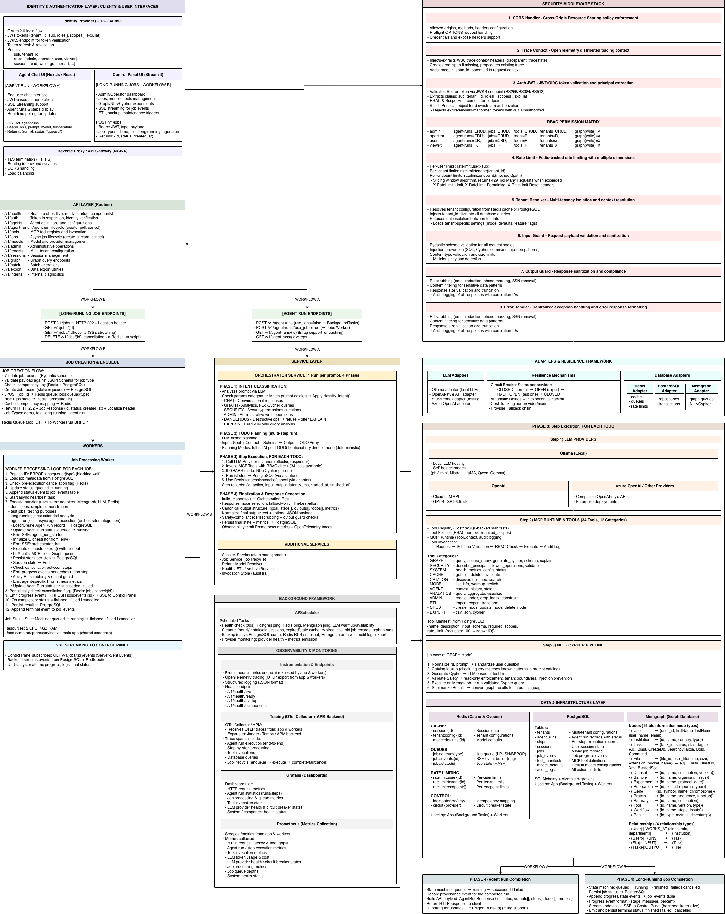

# Cineca Agentic Platform

A production-ready, enterprise-grade **Agentic AI Platform** built with FastAPI that enables intelligent LLM-powered agents to interact with graph databases (Memgraph), execute tools via MCP (Model Context Protocol), and orchestrate complex multi-step workflows—all with comprehensive security, observability, and multi-tenancy support.

**[Live Demo](https://armanfeili.github.io/sapienza-msc-thesis-cineca-agentic-platform/)** — See the Agent Chat UI in action

📄 **[Thesis (PDF)](thesis/main/sapthesis-doc.pdf)** — Full master's thesis document
📊 **[Presentation (PDF)](thesis/sapthesis/Presentation/Presentation.pdf)** — Defence presentation slides

[](https://github.com/ILP-Thesis-2025/Cineca-Agentic-Platform/actions/workflows/ci.yml)
[](https://www.python.org/downloads/)
[](https://fastapi.tiangolo.com)
[](LICENSE)
[](#testing-strategy)
[](#api-endpoints)
[](#mcp-tools--tooling-ecosystem)
[](https://armanfeili.github.io/sapienza-msc-thesis-cineca-agentic-platform/)

---

## Start Here (Project Map)

| What | Path | Notes |
|------|------|-------|
| **App entry point** | `src/app.py` | FastAPI application factory |
| **Orchestrator** | `src/services/orchestrator.py` | Agent run execution engine |
| **Routers (API)** | `src/routers/` | HTTP endpoints by domain |
| **Security** | `src/security/` | JWT, RBAC, PII, rate limits |
| **MCP Tools** | `src/mcp/tools/` | Tool implementations |
| **Postgres repos** | `db/postgres_control/repositories/` | Data access layer |
| **Migrations** | `db/migrations/` | Alembic schema migrations |
| **Redis layer** | `db/redis_cache/` | Cache, queues, rate limits |
| **Memgraph domain** | `db/memgraph_domain/` | Graph schema + NL->Cypher |
| **Worker entry** | `src/workers/` | Background job processing |
| **Agent Chat UI** | `ui_agent/` | Next.js frontend |
| **Control Panel UI** | `ui_control_panel/` | Streamlit admin UI |
| **Config** | `src/config.py` | Pydantic settings |
| **Tests** | `tests/` | Unit, integration, e2e, security |

---

## Configuration & Environment

> **Template:** See [.env.example](.env.example) for the full annotated template with all available options.

---

## Quickstart & Running

### Prerequisites
- Docker + Docker Compose v2
- Bash (for helper scripts)
- Node.js 20 (only if running the Next.js UI locally outside Docker)

### Start with Docker Compose
The simplest way to run the full stack is via **Docker Compose**:

1. Ensure Docker and Docker Compose are installed.
2. Configure environment variables (e.g., `.env` file).
3. Launch the stack:
   ```bash
   docker compose up -d --build --remove-orphans
   ```
4. Access services via the ports listed below.

### Access Points (Ports & URLs)
Use the following ports to interact with the platform:

| Service | Container Port | Default Host Port | URL Pattern |
|---------|----------------|-------------------|-------------|
| **FastAPI Backend** | 8000 | 8000 | `http://localhost:8000/v1/docs/` |
| **Agent Chat UI** | 3000 | 3002 | `http://localhost:3002` |
| **Control Panel UI** | 8501 | 8501 | `http://localhost:8501` |
| **PostgreSQL** | 5432 | 5432 | `postgresql://localhost:5432` |
| **Redis** | 6379 | 6379 | `redis://localhost:6379` |
| **Memgraph** | 7687 | 7687 | `bolt://localhost:7687` |
| **Memgraph Lab** | 3000 | 3000 | `http://localhost:3000/login` |
| **Prometheus** | 9090 | 9090 | `http://localhost:9090` |
| **Grafana** | 3000 | 3001 | `http://localhost:3001/login` |
| **Ollama** | 11434 | 11434 | `http://localhost:11434` |

> **Note:** Actual ports may differ based on `docker-compose.override.yml` or variant files.

### Verification
**1. Health Check**
Check if the backend is ready:
```bash
curl -s <BACKEND_BASE_URL>/v1/health/ready | jq
```

**2. Auth Introspection**
Verify authentication (requires token):
```bash
# Fetch token first: ./fetch_auth0_tokens.sh --save-to-env
curl -s -H "Authorization: Bearer $ACCESS_TOKEN" \
  <BACKEND_BASE_URL>/v1/auth/me | jq
```

**3. Create an Agent Run**
Test the agent functionality:
```bash
# Create run
RUN_ID=$(curl -s -X POST <BACKEND_BASE_URL>/v1/agent-runs \
  -H "Authorization: Bearer $ACCESS_TOKEN" \
  -H "Content-Type: application/json" \
  -d '{"prompt": "Hello, world!"}' | jq -r '.id')

# Poll status
curl -s -H "Authorization: Bearer $ACCESS_TOKEN" \
  <BACKEND_BASE_URL>/v1/agent-runs/$RUN_ID | jq '.status'
```

### Development Workflows

#### Option A: Hybrid (Docker Backend + Local UI)
Recommended for frontend development where you need to iterate on the UI quickly while keeping backend stability.

1.  Run backend services in Docker:
    ```bash
    docker compose up -d postgres redis memgraph backend worker
    ```
2.  Run UI locally:
    ```bash
    cd ui_agent
    npx next dev -p 3002
    ```

#### Option B: Local Python Dev
Recommended for backend development.

1.  Start infrastructure (Docker):
    ```bash
    docker compose up -d postgres redis memgraph
    ```
2.  Setup environment and run:
    ```bash
    python -m venv .venv && source .venv/bin/activate
    pip install -r requirements.txt
    uvicorn src.app:app --reload
    ```

### Advanced Configurations
- **GPU Support:** `docker compose -f docker-compose.yml -f docker-compose.gpu.yml up -d`
- **Nginx Proxy:** `docker compose -f docker-compose.yml -f docker-compose.nginx.yml up -d`
- **Full Settings:** See [.env.example](.env.example)

### Read this first
- [High-Level Architecture](#high-level-architecture)
- [Security & Governance](#security--governance)
- [API Endpoints](#api-endpoints)

---

## Table of Contents

1. [Start Here (Project Map)](#start-here-project-map)
2. [Configuration & Environment](#configuration--environment)
3. [Quickstart & Running](#quickstart--running)
4. [Overview](#overview)
5. [Glossary](#glossary)
6. [Key Features](#key-features)
7. [High-Level Architecture](#high-level-architecture)
8. [Comparison with SOTA](#comparison-with-sota)
9. [Execution Workflows](#execution-workflows)
   - [Workflow A: Synchronous Agent Runs](#workflow-a-synchronous-agent-runs)
   - [Workflow B: Async Job-Based Execution](#workflow-b-async-job-based-execution)
   - [Workflow Comparison](#workflow-comparison)
10. [Project Structure](#project-structure)
11. [Core Backend](#core-backend)
    - [API Layer](#api-layer)
    - [Domain Schemas](#domain-schemas)
    - [Error Handling](#error-handling)
    - [Configuration & Compute Settings](#configuration--compute-settings)
12. [Data & Persistence Layer](#data--persistence-layer)
    - [PostgreSQL Control Plane](#postgresql-control-plane)
    - [Redis Cache & Queues](#redis-cache--queues)
    - [Memgraph Graph Domain](#memgraph-graph-domain)
13. [Services & Orchestrator](#services--orchestrator)
    - [Service Layer](#service-layer)
    - [Intent Classification](#intent-classification)
    - [Agent Orchestration Engine](#agent-orchestration-engine)
    - [LLM Resilience & Cost Control](#llm-resilience--cost-control)
14. [MCP Tools & Tooling Ecosystem](#mcp-tools--tooling-ecosystem)
    - [MCP Runtime Internals](#mcp-runtime-internals)
    - [Tool Inventory](#tool-inventory)
15. [Jobs, Workers & Background Tasks](#jobs-workers--background-tasks)
    - [Asynchronous Jobs](#asynchronous-jobs)
    - [Worker Processes](#worker-processes)
    - [Background Framework](#background-framework)
16. [Security & Governance](#security--governance)
    - [Authentication & Identity](#authentication--identity)
    - [Authorization & Roles](#authorization--roles)
    - [Rate Limiting, PII & Output Guards](#rate-limiting-pii--output-guards)
    - [Audit & Compliance](#audit--compliance)
17. [Observability & Health](#observability--health)
    - [Metrics](#metrics)
    - [Tracing](#tracing)
    - [Health Probes](#health-probes)
18. [Utilities & Cross-Cutting Helpers](#utilities--cross-cutting-helpers)
19. [User Interfaces](#user-interfaces)
    - [Agent Chat UI](#agent-chat-ui)
    - [Control Panel UI](#control-panel-ui)
20. [Troubleshooting](#troubleshooting)
21. [Operational Scripts & Tooling](#operational-scripts--tooling)
22. [Testing Strategy](#testing-strategy)
    - [Test Metrics](#test-metrics)
    - [Memgraph NL Test Mode](#memgraph-nl-test-mode)
23. [Typical End-to-End Flows](#typical-end-to-end-flows)
24. [Production Notes & Best Practices](#production-notes--best-practices)
25. [API Endpoints](#api-endpoints)
26. [Contributing](#contributing)
27. [License](#license)
28. [Acknowledgments](#acknowledgments)
29. [Detailed Workflow Documentation](#detailed-workflow-documentation)


## Overview

The platform provides a complete stack to **design, execute, and observe agentic AI workflows**:

- A **FastAPI** backend that exposes the Agents API, Jobs API, Models/Providers API, MCP tools API, Tenants API, and Health endpoints.
- A **service layer** that orchestrates LLM providers, tools, and databases through an extensible agent engine.
- A **PostgreSQL control plane** storing tenants, agents, runs, steps, jobs, tools, model definitions, and audit logs.
- A **Redis data plane** for caching, job queues, rate limiting, idempotency, and session state.
- A **Memgraph graph database** with a domain model and secure NL->Cypher capabilities for graph Q&A.
- A **resilience framework** with provider fallback, circuit breakers, and cost tracking.
- A **security framework** with OIDC/JWT, RBAC, PII scrubbing, rate limiting, and output guards.
- A **background framework** for scheduled health checks, backups, and cleanups.
- Two **user interfaces**:
  - A **Next.js chat UI** for end users.
  - A **Streamlit control panel** for admins and operators.
- A comprehensive **observability** setup (Prometheus metrics, tracing, structured logging) and a **test suite** covering unit, integration, e2e, security, and performance tests.

The design goal is to be **production-ready**: opinionated about safety, observability and resilience, but flexible enough to integrate with diverse LLM providers and graph workloads.

For a complete list of all platform components, see the [Component Summary](#component-summary) table.

---

## Glossary

- **Tenant**: The isolation boundary for data access, configuration, defaults, and authorization decisions.
- **Principal**: The authenticated caller derived from a JWT (subject + tenant + roles + scopes).
- **Agent Run**: A single execution request that produces a final output and a trace of intermediate steps.
- **Session**: The conversational context/state used across steps (may span multiple runs depending on API usage).
- **Step**: One unit of work inside an agent run (LLM call, tool invocation, graph query, etc.) with persisted inputs/outputs/metrics.
- **Tool (MCP Tool)**: A registered capability callable by agents (and via APIs) with JSON-schema validated inputs and audited outputs.
- **Tool Invocation**: A single execution of a tool, recorded for auditability, observability, and debugging.
- **Provider**: A runtime LLM provider configuration (OpenAI-style, Ollama, Azure OpenAI, etc.).
- **Model Instance**: A resolved model configuration that can be selected/used for inference (often tied to a provider).
- **Control Plane (PostgreSQL)**: The authoritative store for tenants, runs, steps, jobs, tools, manifests, defaults, audit logs, etc.
- **Data Plane (Redis)**: The low-latency layer for caching, queues, rate-limits, idempotency, cancellation flags, and ephemeral state.

### State Machines (Canonical Statuses)

These are the canonical status values used throughout the platform:

**Agent Run:**
`pending` -> `running` -> `succeeded` | `failed` | `cancelled`

**Job:**
`queued` -> `running` -> `finished` | `failed` | `cancelled`

**Circuit Breaker (per provider):**
`CLOSED` -> `OPEN` -> `HALF_OPEN` -> `CLOSED`

---

## Key Features

- **Dual execution workflows**: Synchronous (BackgroundTasks) and async (job queue) execution modes. See [Execution Workflows](#execution-workflows).
- **Agentic orchestration**: Multi-step agent runs with TODO lists, tools, and graph queries. See [Agent Orchestration Engine](#agent-orchestration-engine).
- **Intent classification**: 6 intent modes (chat, graph, security, admin, dangerous, explain) for intelligent request routing.
- **Multi-provider LLM support**: OpenAI-style APIs, Ollama, demo/stub providers. See [LLM Resilience & Cost Control](#llm-resilience--cost-control).
- **Memgraph integration**: Graph schema, ETL, analytics, CRUD, and NL->Cypher pipeline. See [Memgraph Graph Domain](#memgraph-graph-domain).
- **MCP tools**: 34 tools in 17 categories. See [Tool Inventory](#tool-inventory).
- **Asynchronous jobs**: Persistent job lifecycle with SSE streaming. See [Jobs, Workers & Background Tasks](#jobs-workers--background-tasks).
- **Security first**: OIDC/JWT, RBAC, scopes, rate limits, PII scrubbing. See [Security & Governance](#security--governance).
- **Observability**: Prometheus metrics, OpenTelemetry tracing, structured logging. See [Observability & Health](#observability--health).
- **UIs**: Next.js chat UI for users; Streamlit control panel for operators. See [User Interfaces](#user-interfaces).

For detailed component breakdown, see the [Component Summary](#component-summary) table.

---

## High-Level Architecture

The platform is organized in three layers plus cross-cutting concerns. For a comprehensive breakdown of all components, see the [Component Summary](#component-summary) table.

1. **Core Backend** – FastAPI application, service layer, MCP tools, adapters, resilience and background frameworks.
2. **Data & Infrastructure** – PostgreSQL (control plane), Redis (cache/queues), Memgraph (graph), worker processes.
3. **Presentation** – Agent Chat UI (Next.js), Control Panel UI (Streamlit).

**Cross-cutting modules**: Configuration, security, observability, and utilities.

### Diagram conventions (read before the diagrams)

- The ASCII diagrams are conceptual and may abbreviate route families (e.g., `/v1/health`) to represent the broader set of health endpoints documented later.
- Some diagram arrows describe behavior at a high level; the authoritative contracts remain the endpoint tables and schema definitions in `src/schemas/`.
- **Do not edit the diagram blocks**: they are intentionally kept stable as a reference artifact.

### Architecture Diagrams

#### At-a-Glance Architecture

> A quick-glance overview of the platform's main layers and how they connect.



#### Simplified Architecture (recommended first read)

> A simplified view showing the core execution workflows and key components.



#### Full Architecture

> The complete architecture with all workflows, services, databases, and integration points.



---

## Comparison with SOTA

**Capability-by-capability comparison of CINECA Agentic Platform against Top-10 similar platforms.**

| Platform | Full Stack (UI + API + Jobs) | Orchestration Durability | Agent Planning Loop | Tool Ecosystem & Schema | Security & Governance | Graph NL→Cypher Support | Observability | LLM-Agnostic | License / Pricing | Typical Limitation vs CAP | Fit Score |
|----------|------------------------------|--------------------------|---------------------|------------------------|----------------------|------------------------|---------------|--------------|-------------------|---------------------------|-----------|
| **CINECA Agentic Platform** | ✓ Full-stack: UI + API + Jobs | ✓ Durable: retries + checkpoints | ✓ Built-in MCP loop engine | ✓ Native registry + schema audit | ✓ JWT, RBAC, tenancy, I/O guards | ✓ Built-in NL→Cypher with validation & tenancy | ✓ Full telemetry + LLM evals | ✓ Yes (OpenAI, Ollama, etc.) | Custom-built (Internal only) | — | ★ 5.0 |
| **Temporal** | ✗ Engine only (no UI/tools) | ★ Best-in-class workflow durability | ✗ No agentic planning loop | ~ Pluggable tools (not MCP-native) | ✓ Fine-grained RBAC + auth options | ✗ No graph layer | ✓ Metrics + traces | ✓ Yes | Free OSS (MIT) + Paid Cloud | No agentic loop or UI; not a full platform | ★★ 4.0 |
| **Argo Workflows** | ~ K8s-native stack | ✓ DAGs + Retry Semantics | ✗ No agent loop | ~ Container steps only | ~ Basic RBAC via K8s | ✗ No Cypher / graph features | ~ Limited metrics | ✓ Yes | Free OSS (Apache-2.0) | K8s-focused; lacks planning & tool UX | ★★ 3.5 |
| **LangGraph** | ✗ Library only | ✓ Durable w/ state checkpointing | ✓ Agent loop with state machine model | ✓ Built-in agent tool patterns | ✗ No RBAC / audit; DIY needed | ~ Custom NL→Cypher possible | ~ Partial (via adapters) | ✓ Yes | Free OSS (MIT) | No orchestration stack; governance must be added manually | ★★ 4.0 |
| **OpenAI Agents SDK** | ✗ SDK only | ~ Runtime-level retry only | ✓ SDK-defined agent planning | ✓ Typed tools as functions | ✗ No RBAC or tenancy | ~ Custom Cypher interface possible | ~ Logs via app code | ~ Partial (OpenAI-focused) | Free OSS (MIT) + Paid OpenAI API | No job system, no multi-tenant security | ★★ 3.5 |
| **Semantic Kernel** | ✗ Middleware only | ~ Retry via plugins | ✓ Plugin-based agent orchestration | ✓ Tools + DI + planner interfaces | ~ Basic auth via host app | ~ Requires custom NL→Cypher logic | ~ Custom logs via adapters | ✓ Yes | Free OSS (MIT) | Middleware only; lacks orchestration/runtime infra | ★★ 3.5 |
| **LlamaIndex** | ✗ RAG/agent SDK | ~ Partial retries | ✓ Tool-using planner + query agents | ✓ Strong RAG support | ✗ No RBAC, audit, tenancy | ~ External Cypher logic possible | ~ Logs via app code | ✓ Yes | Free OSS (MIT) + Paid Cloud | No durability, security, or orchestration stack | ★★ 3.0 |
| **Haystack** | ✗ Library only | ~ Retryable components | ✓ Agent + tools (non-durable) | ✓ Tool abstraction + DSL | ✗ No auth/governance | ~ Cypher possible w/ custom nodes | ~ Basic logs | ✓ Yes | Free OSS (Apache-2.0) | Not production-grade orchestration | ★★ 3.0 |
| **n8n** | ✓ GUI product + workflow UI | ✓ Retry + error steps | ~ Linear tool invocation (not agentic) | ✓ Large integration catalog | ~ Role-based app-level security | ✗ Not graph-native | ~ Workflow logs; no LLM eval | ✓ Yes | Free OSS (SUL) + Paid Cloud SaaS | Good for automation; lacks agentic structure | ★★ 2.5 |
| **Windmill** | ✓ UI + job scripting platform | ✓ Durable jobs + cron | ✗ No agent loop | ✓ Script-based tool definitions | ✓ RBAC, SSO, auditing | ✗ Not graph-native | ~ Run logs and dashboards | ~ Partial (not LLM-centric) | Free OSS (AGPL mix) + Paid tiers | Good for internal workflows; lacks agent stack | ★★ 3.5 |
| **Langfuse** | ✗ Observability layer only | ✗ No execution | ✗ No planning or tool use | ~ Eval schema for prompts/tools | ~ Some logging support | ✗ Not applicable | ★ Best-in-class for LLM tracing | ✓ Yes | Free OSS (MIT Core) + Paid SaaS | Tracing/monitoring only; no workflow or orchestration | ★★ 3.0 |

### Legend

- ✓ = Full support
- ~ = Partial / requires customization
- ✗ = Not supported
- ★ = Exceptional in this category

---

## Execution Workflows

The platform supports **two execution workflows** for agent runs, each optimized for different use cases:

### Workflow A: Synchronous Agent Runs

**Endpoint**: `POST /v1/agent-runs`  
**Execution**: FastAPI BackgroundTasks (same process)  
**Best For**: Quick responses, simple workflows, low-latency requirements

| Feature | Details |
|---------|--------|
| **Response** | HTTP 201 with `status=queued` + `Location` header |
| **Progress** | Poll `GET /v1/agent-runs/{run_id}` |
| **Persistence** | AgentRun in PostgreSQL |
| **Timeout** | `RUN_TIMEOUT_SECONDS` (configurable) |

**Flow:**
1. Request received → Rate limiting + RBAC validation
2. AgentRun created with `status=queued`
3. Background task scheduled via FastAPI BackgroundTasks
4. Orchestrator executes: Intent Classification → Mode Handler → TODO Planning → Step Execution
5. Results persisted → Status updated to `succeeded`/`failed`
6. Client polls for completion

**Intent Classification Modes:**
- `chat` - General conversational responses
- `graph` - Graph database queries (NL→Cypher)
- `security` - Security/permissions questions
- `admin` - Administrative write operations
- `dangerous` - Potentially dangerous queries (refused with EXPLAIN alternative)
- `explain` - EXPLAIN-only query analysis

### Workflow B: Async Job-Based Execution

**Endpoint**: `POST /v1/jobs` (type: `agent.run`)  
**Execution**: Dedicated worker process with Redis queue  
**Best For**: Complex orchestration, long-running tasks, fault tolerance

| Feature | Details |
|---------|--------|
| **Response** | HTTP 202 with job ID + `Location` header |
| **Progress** | SSE stream via `GET /v1/jobs/{id}/events` |
| **Persistence** | Job + AgentRun (linked) in PostgreSQL |
| **Cancellation** | Full support via `DELETE /v1/jobs/{id}` |
| **Scalability** | Horizontal worker scaling |

**Flow:**
1. Job created with `status=queued` → Enqueued to Redis
2. Worker polls Redis → Loads job from PostgreSQL
3. Status: `queued` → `running`
4. Orchestrator executes (same core logic as Workflow A)
5. Progress events emitted via SSE
6. Results persisted → Status: `running` → `finished`/`failed`/`cancelled`

**SSE Event Types:**
- `agent_run_started` - Agent run initialized
- `orchestrator_init` - Orchestrator ready
- `orchestration_start` - Execution beginning
- `progress` - Per-step progress updates
- `orchestration_complete` - Final result available
- `status` - Status transitions

### Workflow Comparison

| Aspect | Workflow A (Sync) | Workflow B (Async) |
|--------|-------------------|-------------------|
| **Endpoint** | `POST /v1/agent-runs` | `POST /v1/jobs` |
| **Execution Context** | FastAPI BackgroundTasks | Dedicated Worker Process |
| **Progress Updates** | Polling | SSE Real-time Streaming |
| **Cancellation** | Limited | Full support via Redis flags |
| **Fault Tolerance** | Lost on restart | Survives restarts |
| **Scalability** | Single API process | Horizontal worker scaling |
| **Use Cases** | Quick chat, simple Q&A | Complex orchestration, batch processing |

**Shared Components (~80% overlap):**
- Authentication & RBAC validation
- Intent classification system
- Orchestrator core (mode handlers, TODO planning, step execution)
- LLM client management with fallback
- MCP tools integration (32+ tools)
- Graph pipeline (NL→Cypher)
- PII scrubbing & output guard
- Metrics emission & provenance logging

> 📖 **Detailed Documentation:**
> - [WORKFLOW_A.md](docs/workflows/WORKFLOW_A.md) - Complete synchronous workflow documentation
> - [WORKFLOW_B.md](docs/workflows/WORKFLOW_B.md) - Complete async job workflow documentation

---

## Component Summary

| Layer | Components | Responsibilities |
|-------|------------|------------------|
| **Identity** | Auth0 / OIDC Provider | OAuth login, JWT tokens, JWKS |
| **Clients** | Agent Chat UI (Next.js), Control Panel UI (Streamlit) | User/Admin interfaces |
| **Edge** | Reverse Proxy (NGINX) | TLS, routing, CORS |
| **Backend** | FastAPI Application | API, services, orchestration, security |
| **Services** | Orchestrator, Session, Job, Health, ETL, Archive | Business logic & workflows |
| **MCP Tools** | 34 tools in 17 categories | graph, cache, data, security, system, etc. |
| **Adapters** | LLM, Memgraph, Redis adapters | External service integration |
| **Resilience** | Circuit breakers, retries, fallback, cost tracking | LLM reliability |
| **Data** | PostgreSQL (control), Redis (cache/queues), Memgraph (graph) | Persistence & state |
| **Workers** | Job processing worker | Async long-running tasks |
| **LLM** | Ollama, OpenAI, Azure OpenAI | Language model inference |
| **Observability** | Prometheus, Grafana, OTEL Collector | Metrics, traces, dashboards |

## Key Metrics

| Metric | Value |
|--------|-------|
| **API Endpoints** | 76 across 16 categories |
| **MCP Tools** | 34 tools, 17 categories |
| **Test Cases** | 3,000+ |
| **Test Files** | 236 |

---

## Project Structure

```
Cineca-Agentic-Platform/
├── src/                              # Main application source code
│   ├── app.py                        # FastAPI application factory
│   ├── config.py                     # Pydantic settings configuration
│   ├── logging_setup.py              # Structured logging configuration
│   ├── audit_logger.py               # Audit logging utilities
│   ├── provenance.py                 # Data provenance tracking
│   ├── background.py                 # Background task scheduler
│   ├── adapters/                     # External service adapters (LLM, DB)
│   ├── agent_policies/               # Agent behavior policies
│   ├── background/                   # Background task implementations
│   ├── config_modules/               # Modular configuration
│   ├── errors/                       # Error definitions and handlers
│   ├── health/                       # Health check implementations
│   ├── i18n/                         # Internationalization
│   ├── jobs/                         # Job definitions and handlers
│   ├── mcp/                          # Model Context Protocol implementation
│   │   ├── runtime.py                # MCP tool runtime (RBAC, audit, metrics)
│   │   ├── tool_registry.py          # Central tool registry
│   │   ├── tool_policy.py            # Tool access policies
│   │   ├── schemas.py                # MCP-specific schemas
│   │   ├── manifest.json             # Tool definitions
│   │   ├── policies.yaml             # Tool policies configuration
│   │   └── tools/                    # Tool implementations (19 categories)
│   │       ├── agent/                # Agent context tools
│   │       ├── cache/                # Cache management tools
│   │       ├── catalog/              # Tool catalog discovery
│   │       ├── data/                 # Data manipulation tools
│   │       ├── db/                   # Database tools
│   │       ├── errors/               # Error reporting tools
│   │       ├── graph/                # Graph query tools
│   │       ├── model/                # Model management tools
│   │       ├── output/               # Output formatting tools
│   │       ├── privacy/              # Privacy consent tools
│   │       ├── ratelimit/            # Rate limiting tools
│   │       ├── security/             # Security audit tools
│   │       ├── session/              # Session management tools
│   │       ├── system/               # System health tools
│   │       ├── tenancy/              # Multi-tenant tools
│   │       ├── user/                 # User profile tools
│   │       └── viz/                  # Visualization tools
│   ├── memgraph/                     # Memgraph integration utilities
│   ├── metrics/                      # Prometheus metrics definitions
│   ├── middleware/                   # FastAPI middleware
│   ├── models/                       # SQLAlchemy ORM models
│   ├── observability/                # Tracing and observability
│   ├── repositories/                 # Data access repositories
│   ├── resilience/                   # Circuit breakers, retries, fallback
│   ├── routers/                      # API route handlers
│   │   ├── admin.py                  # Admin operations
│   │   ├── admin_db.py               # Admin database operations
│   │   ├── admin_jobs.py             # Admin job management
│   │   ├── admin_ops.py              # Admin operational endpoints
│   │   ├── agent.py                  # Agent sessions & steps
│   │   ├── agent_runs.py             # Agent run execution
│   │   ├── auth.py                   # Authentication endpoints
│   │   ├── batch.py                  # Batch operations
│   │   ├── export_import.py          # Data export/import
│   │   ├── health.py                 # Health probes (v1)
│   │   ├── health_v2.py              # Health probes (v2)
│   │   ├── internal_db.py            # Internal database endpoints
│   │   ├── internal_ops.py           # Internal operations
│   │   ├── jobs.py                   # Background job management
│   │   ├── manifests.py              # Manifest management
│   │   ├── model_instances.py        # Model instance management
│   │   ├── model_management.py       # Model configuration
│   │   ├── model_processes.py        # Model processes
│   │   ├── models.py                 # Model endpoints
│   │   ├── tenants.py                # Tenant management
│   │   ├── tenants_admin.py          # Tenant admin operations
│   │   └── tools.py                  # Tool discovery & invocation
│   ├── schemas/                      # Pydantic request/response models
│   ├── scripts/                      # Application scripts
│   ├── security/                     # Security modules
│   │   ├── admin.py                  # Admin security
│   │   ├── audit.py                  # Security audit logging
│   │   ├── auth.py                   # Authentication logic
│   │   ├── authorization.py          # Authorization checks
│   │   ├── graph_access_policy.py    # Graph access policies
│   │   ├── intent_filter.py          # Intent filtering
│   │   ├── internal.py               # Internal security
│   │   ├── jwt.py                    # JWT validation
│   │   ├── model_perms.py            # Model permissions
│   │   ├── output_guard.py           # Output safety guard
│   │   ├── perm.py                   # RBAC permissions
│   │   ├── pii_scrubber.py           # PII detection/redaction
│   │   ├── policies_loader.py        # Policy loading
│   │   ├── rate_limit.py             # Rate limiting
│   │   ├── secrets.py                # Secrets management
│   │   ├── tenants.py                # Tenant security
│   │   └── validators.py             # Input validators
│   ├── services/                     # Business logic services
│   │   ├── archive.py                # Archive service
│   │   ├── default_model_resolver.py # DMR for model selection
│   │   ├── etl.py                    # ETL operations
│   │   ├── health.py                 # Health service
│   │   ├── intent_classifier.py      # Query intent classification
│   │   ├── invocation_store.py       # Tool invocation storage
│   │   ├── job_store.py              # Job storage
│   │   ├── jobs_service.py           # Jobs business logic
│   │   ├── model_warmup.py           # LLM warmup service
│   │   ├── orchestrator.py           # Agent orchestration engine
│   │   ├── process_service.py        # Process management
│   │   ├── prompt_catalog.py         # Prompt templates
│   │   ├── service_metrics.py        # Service-level metrics
│   │   ├── session.py                # Session management
│   │   ├── session_fallback.py       # Session fallback logic
│   │   ├── status.py                 # Status service
│   │   └── tenants.py                # Tenant service
│   ├── utils/                        # Shared utilities
│   └── workers/                      # Background job workers
│
├── db/                               # Database layer
│   ├── populate.py                   # Database population script
│   ├── postgres_control/             # PostgreSQL control plane
│   │   ├── database.py               # Database connection
│   │   ├── init.sql                  # Initial schema
│   │   ├── seed_tenants.py           # Tenant seeding
│   │   ├── alembic/                  # Alembic migrations
│   │   ├── alembic.ini               # Alembic configuration
│   │   ├── models/                   # SQLAlchemy models
│   │   └── repositories/             # Data access objects
│   ├── redis/                        # Redis utilities
│   ├── redis_cache/                  # Redis caching layer
│   ├── memgraph_domain/              # Memgraph graph database
│   │   ├── config.py                 # Memgraph configuration
│   │   ├── memgraph_client.py        # Memgraph client
│   │   ├── populate.py               # Graph population
│   │   ├── create_original_db.py     # Original dataset loader
│   │   ├── original-dataset/         # Reference graph data
│   │   └── populated/                # Populated graph exports
│   └── migrations/                   # Additional migrations
│
├── tests/                            # Test suite (3,000+ test cases)
│   ├── conftest.py                   # Shared fixtures
│   ├── agents/                       # Agent-specific tests
│   ├── api/                          # API endpoint tests
│   ├── caching/                      # Cache tests
│   ├── compliance/                   # Compliance tests
│   ├── db/                           # Database tests
│   ├── e2e/                          # End-to-end tests
│   ├── fixtures/                     # Test fixtures
│   ├── health/                       # Health check tests
│   ├── integration/                  # Integration tests
│   ├── internal_db/                  # Internal DB tests
│   ├── jobs/                         # Job tests
│   ├── mcp/                          # MCP tool tests
│   ├── middleware/                   # Middleware tests
│   ├── observability/                # Observability tests
│   ├── performance/                  # Performance tests
│   ├── resilience/                   # Resilience tests
│   ├── routers/                      # Router tests
│   ├── scripts/                      # Script tests
│   ├── security/                     # Security tests
│   ├── smoke/                        # Smoke tests
│   ├── sse/                          # SSE tests
│   ├── ui_control_panel/             # UI tests
│   ├── unit/                         # Unit tests
│   └── utils/                        # Utility tests
│
├── scripts/                          # Utility scripts
│   ├── api-polish/                   # API refinement scripts
│   ├── auth/                         # Authentication scripts
│   ├── database/                     # Database backup/restore
│   ├── debug/                        # Debugging utilities
│   ├── deployment/                   # Deployment scripts
│   ├── manifest/                     # Manifest management
│   ├── ollama/                       # Ollama LLM scripts
│   ├── openapi/                      # OpenAPI generation
│   ├── security/                     # Security scripts
│   ├── testing/                      # Test utilities
│   └── verification/                 # Verification scripts
│
├── docs/                             # Documentation
│   ├── adr/                          # Architecture Decision Records
│   ├── agents/                       # Agent documentation
│   ├── api/                          # API documentation
│   ├── architecture/                 # Architecture docs
│   ├── compliance/                   # Compliance docs
│   ├── database/                     # Database docs
│   ├── diagrams/                     # Architecture diagrams
│   ├── features/                     # Feature documentation
│   ├── guides/                       # User guides
│   ├── mcp/                          # MCP documentation
│   ├── observability/                # Observability docs
│   ├── operations/                   # Operations guides
│   ├── orchestrator/                 # Orchestrator docs
│   ├── production/                   # Production guides
│   ├── quickstarts/                  # Quickstart guides
│   ├── reference/                    # Reference documentation
│   ├── schema/                       # Schema documentation
│   ├── security/                     # Security documentation
│   ├── testing/                      # Testing documentation
│   └── ui/                           # UI documentation
│
├── api/                              # OpenAPI specifications
│   ├── openapi.json                  # Main OpenAPI spec
│   ├── openapi_v1.json               # v1 API spec
│   ├── openapi_v2.json               # v2 API spec
│   └── openapi_with_batch_export.json
│
├── examples/                         # Usage examples
│   ├── cli/                          # CLI examples
│   ├── data/                         # Sample data
│   └── tools/                        # Tool examples
│
├── monitoring/                       # Monitoring configuration
│   └── grafana/                      # Grafana dashboards
│
├── ops/                              # Operations configuration
│   ├── backup/                       # Backup scripts
│   ├── grafana/                      # Grafana setup
│   ├── nginx/                        # NGINX configuration
│   └── prometheus/                   # Prometheus configuration
│
├── ui_agent/                         # Next.js agent chat UI
├── ui_control_panel/                 # Streamlit control panel UI
│
├── docker-compose.yml                # Main Docker Compose
├── docker-compose.gpu.yml            # GPU support variant
├── docker-compose.nginx.yml          # NGINX variant
├── docker-compose.override.yml       # Local overrides
├── docker-compose.override.dev.yml   # Development overrides
├── Dockerfile                        # Multi-stage Docker build
├── docker-entrypoint.sh              # Container entrypoint
├── Makefile                          # Development commands
├── pyproject.toml                    # Python project configuration
├── requirements.txt                  # Python dependencies
├── conftest.py                       # Root test configuration
├── fetch_auth0_tokens.sh             # Auth0 token fetching script
├── .env.example                      # Environment template
└── README.md                         # This file
```

---

## Core Backend

### API Layer

The backend is implemented with **FastAPI**, exposing a versioned HTTP API. Major domains:

- **Agents**
  - Create and manage *agent runs*.
  - Manage *sessions* and *steps* for each agent run.
  - Report execution metrics and TODO items.
- **Jobs**
  - Submit long-running jobs.
  - Poll job status.
  - Stream job events via Server-Sent Events (SSE).
- **Models & Providers**
  - Register and manage model providers.
  - List models, configure defaults, and test connectivity.
- **MCP Tools**
  - Discover tools and schemas.
  - Invoke tools with structured requests/responses.
- **Tenants**
  - Manage tenants and tenant-bound configuration.
- **Health & Meta**
  - Liveness, readiness, startup probes.
  - Component-level health.
  - Introspection endpoints (OpenAPI export, etc).

The API adheres to consistent patterns:

- **JSON schemas** are defined centrally in the schemas package.
- **Idempotency** for safe retry of selected endpoints.
- **Pagination** using token-based cursors.
- **ETags** to support conditional GETs.
- **Rate limiting** integrated into request handling.
- **Standardized errors** via Problem Details (see below).

### Domain Schemas

The **schemas** package defines all request and response models using Pydantic:

- **Agents & Runs**
  - Requests to create runs, resume sessions, and list runs.
  - Response models for runs, steps, TODO items, and execution metrics.
- **Jobs**
  - Job creation requests and job status responses.
  - Event payloads for streamed logs and status transitions.
- **Models & Providers**
  - Provider registration payloads.
  - Model definitions, health checks, configuration overrides.
- **Tools**
  - Tool metadata, invocation requests, and results.
- **Tenants, Auth, Admin**
  - Tenant definitions.
  - Auth responses.
  - Admin operations payloads.

These schemas are the **single source of truth** for the API, ensuring consistency between code and documentation.

### Error Handling

The backend uses an **RFC 7807 Problem Details** pattern for error responses:

- A **ProblemDetail** structure with:
  - `type`, `title`, `status`, `detail`, `instance`.
  - A `code` field referencing an internal error code enumeration.
  - Optional structured fields for additional context.
- Helper functions make it easy to:
  - Create error responses consistently.
  - Raise standardized HTTP exceptions for common scenarios (e.g., “session not found”, “invalid cursor”, “duplicate session”, conflicts, bad requests).

All service and API layers are encouraged to use these helpers, resulting in predictable and debuggable error contracts.

### Configuration & Compute Settings

Configuration is centralized in a **settings** module with environment-driven configuration. A specialized **compute configuration** layer derives runtime parameters for:

- Concurrency levels.
- Timeouts for LLM calls and tool invocations.
- CPU vs GPU vs MPS usage for local LLMs (e.g. Ollama).
- Test mode overrides (e.g., shorter timeouts, stubbed providers).

This derived configuration is consumed by:

- Orchestrator and service layer.
- LLM adapters and resilience framework.
- Workers and background tasks.

It allows the platform to adapt to different runtime environments (laptop, CI, production cluster) without modifying code.

---

## Data & Persistence Layer

### PostgreSQL Control Plane

PostgreSQL is the **authoritative source of truth** for control-plane entities:

- **Tenants**
- **Providers and Model Instances**
- **Agent Runs, Sessions, and Steps**
- **Jobs and Job Events**
- **MCP tools and tool invocations**
- **Built-in manifests and processes**
- **User default models**
- **Idempotency keys**
- **Audit logs and internal operations**

The database layer consists of:

- **ORM Models** (SQLAlchemy):
  - UUID primary keys, JSONB fields, and rich indexes.
  - ETag support for caching and concurrency.
- **Migrations**:
  - An Alembic migration chain that evolves the schema over time.
  - Additional carefully-crafted SQL migrations for:
    - Converting text to JSONB outputs.
    - Adding warning/metrics fields with indexes.
    - Creating internal operations audit tables.
- **Repositories**:
  - Encapsulate data access logic for each domain:
    - Agents, Sessions, Steps, Jobs, Tenants, Providers, Models, Tools, Manifests, Defaults, Audit.
  - Implement cursor-based pagination and ETag calculation.
  - Integrate Redis caching where beneficial.

The repositories are the main entry point used by services, ensuring consistent behavior and isolation from raw SQL.

### Redis Cache & Queues

Redis is used as a high-performance **cache and coordination layer**:

- **Cache**
  - JSON-encoded objects (runs, model configs, provider metadata).
  - Short-lived caches for hot paths.
- **Jobs**
  - Job queues per job type.
  - An event buffer for job progress that powers SSE streaming.
- **Agent State**
  - Session storage and step sequence management.
  - Cancellation flags and ephemeral state.
  - Idempotency keys for APIs.
- **Rate Limiting**
  - Sliding windows per user/tenant and per scope.
  - Efficient Lua scripts for atomic increments and checks.
- **Maintenance**
  - Pruning expired keys and managing housekeeping tasks.

When Redis is unavailable, many components are designed to degrade gracefully where possible.


### Memgraph Graph Domain

Memgraph provides a **graph data store** used for rich relationships and graph analytics (bioinformatics-focused schema):

- **Domain Schema** (14 node types, 4 relationship types):
  - **Nodes**:
    - `(:User {user_id, firstName, lastName, user_name, email})` – Research personnel
    - `(:Institution {id, name, country, type})` – Research institutions
    - `(:Task {task_id, status, start, tags})` – Computational tasks (Blast, CreateDb, SearchbyTaxon, Bold, Command)
    - `(:File {file_id, user_filename, size, extension})` – Data files (Fasta, BlastDb, Xml, BlastedSeq, PhyloTree)
    - `(:Dataset {id, name, description, version})` – Data collections
    - `(:Sample {id, name, organism, tissue})` – Biological samples
    - `(:Experiment {id, name, protocol, date})` – Lab experiments
    - `(:Publication {id, doi, title, journal, year})` – Research papers
    - `(:Gene {id, symbol, name, chromosome})` – Genetic entities
    - `(:Protein {id, name, sequence, function})` – Protein entities
    - `(:Pathway {id, name, description})` – Biological pathways
    - `(:Tool {id, name, version, type})` – Analysis software
    - `(:Workflow {id, name, steps, inputs})` – Processing pipelines
    - `(:Result {id, type, metrics, timestamp})` – Analysis outputs
  - **Relationships**:
    - `(User)-[:WORKS_AT {since, role, department}]->(Institution)` – User-Institution affiliation
    - `(User)-[:RUNS]->(Task)` – User executes task
    - `(File)-[:INPUT]->(Task)` – File is input to task
    - `(Task)-[:OUTPUT]->(File)` – Task produces output file
- **Population & ETL**: Scripts to load reference "original dataset" and synthetic bioinformatics data. Export/import via JSONL and CSV for reproducible states.
- **Graph Operations**: Analytics (counts, degree, centrality), CRUD for nodes and relationships, schema discovery and search.

#### NL→Cypher Pipeline (Canonical Reference)

This is the authoritative description of the 6-stage natural language to Cypher translation pipeline used throughout the platform:

1. **Normalize NL Prompt** – Input sanitization, entity extraction, context enrichment, and intent signal extraction.
2. **Catalog Lookup** – Check if the query matches a known pattern in the prompt catalog for deterministic execution.
3. **Generate Cypher** – LLM-based query generation with schema context (or test hints lookup in test mode).
4. **Validate Safety** – 6-layer validation: syntax checking, read-only enforcement, tenant boundary isolation, depth/complexity limits, timeout guards, and result size caps.
5. **Execute on Memgraph** – Run the validated Cypher query with tenant filtering and timeout enforcement.
6. **Summarize Results** – LLM-based summarization to natural language (or direct count bypass for efficiency).

This pipeline is invoked when the orchestrator operates in **Graph Mode** (see [Agent Orchestration Engine](#agent-orchestration-engine)) and is also used by graph tools and the Control Panel UI's Cypher/Graph tab.

---

## Services & Orchestrator

### Service Layer

The service layer implements **business logic** on top of adapters and repositories. It follows a consistent pattern:

- Base classes for services with:
  - Typed results (`ServiceResult`).
  - Status enumeration (`ServiceStatus`).
  - Consistent error handling and logging.
- Example services:
  - **Orchestrator Service**
  - **Session Service** (managing chat sessions and message history).
  - **Default Model Resolver** (tenant-aware default LLM selection).
  - **Archive Service** (snapshot and archive graph or system state).
  - **ETL Service** (import/export graph data).
  - **Health Service** (aggregated status from Redis, Memgraph, Postgres, providers).
  - **Invocation Store** (cache for tool invocation results).
  - **Job Service** (job lifecycle).

Services are orchestrated by the API layer and by workers.

### Intent Classification

Before executing an agent run, the platform categorizes the user prompt with a **lightweight intent classifier**:

- Primary modes:
  - `CHAT` – normal conversational use.
  - `GRAPH` – graph analytics and data retrieval operations.
  - `SECURITY` – security context queries.
  - `ADMIN` – administrative tasks.
  - `DANGEROUS` – potentially destructive or sensitive operations.
- Pipeline:
  1. Match against known tool catalog patterns.
  2. Detect obviously dangerous expressions (e.g., “drop all”, “delete everything”).
  3. Identify admin/security/graph use cases.
  4. Fall back to chat.
- Output:
  - Mode, confidence score, and an explanation for the classification.

This classifier feeds directly into the orchestrator and is intertwined with security (e.g., requiring admin roles for certain intents).

### Agent Orchestration Engine

The **orchestrator** is the central engine that executes agent runs:

1. **Mode Selection**
   - Uses intent classification to pick an execution route (chat, graph, security, admin, dangerous).
2. **Planning**
   - Builds a TODO list of steps to answer the user’s request.
   - Steps may involve LLM calls, tool invocations, graph operations, or intermediate reasoning.
3. **Execution**
   - For each step:
     - Calls the appropriate LLM provider (via adapters and resilience layer).
     - Invokes MCP tools with structured requests.
     - Executes Memgraph queries if in graph mode.
     - Records inputs, outputs, timing, and errors to PostgreSQL.
4. **Graph Mode**
   - Uses the [NL->Cypher Pipeline](#nlcypher-pipeline-canonical-reference) for natural language graph queries.
5. **Dangerous Mode**
   - For clearly destructive operations, the engine may:
     - Refuse to execute and return a safe explanation.
     - Suggest alternative “EXPLAIN-only” operations.
6. **Output**
   - The final answer is normalized into a consistent format:
     - Text, structured JSON, or combined forms.
   - Detailed **steps and metrics** can be inspected via API and UIs.

This engine is responsible for coordinating all moving pieces (LLMs, tools, graph, DB) while obeying security and resource policies.

### LLM Resilience & Cost Control

LLM calls are handled through a **resilience framework**:

- **Provider Pool**
  - Multiple providers can be configured for a given capability.
  - Each with priority, timeouts, and budget.
- **Circuit Breakers**
  - States: `CLOSED`, `OPEN`, `HALF_OPEN`.
  - Per-provider error thresholds and recovery rules.
- **Cost Tracker**
  - Tracks token usage and cost over time.
  - Enforces per-provider budgets.
- **Fallback Behavior**
  - Attempt the primary provider first.
  - On failure or budget exhaustion, fallback to the next provider.
  - Provide metadata about which provider actually served the request.

A deterministic stub provider is available in tests to ensure reproducible behavior.

### Registry-Based Model Management

- **Providers are registered in the control plane (PostgreSQL)** – Each provider entry includes a name, base URL, credentials, and configuration.
- **Model instances reference providers** – They are the selectable runtime units used by agents and APIs.
- **Local LLMs (e.g., Ollama) are onboarded** by registering a provider with a `base_url` pointing to the local server and creating model instances that reference local model IDs.
- **Usage is tracked** (tokens, latency) for observability and debugging. Monetary cost tracking is optional and may be zero for local/self-hosted providers.

---

## MCP Tools & Tooling Ecosystem

The platform implements a rich ecosystem of **Model Context Protocol (MCP) tools**, accessible to agents and directly via APIs:

- **Catalog & Discovery**
  - List all tools and their schemas.
  - Describe inputs and outputs.
- **Common Tool Families**
  - `graph.*` – graph analytics, CRUD, secure querying.
  - `cache.*` – cache management and invalidation.
  - `data.*` – archival, integrity checks, duplicates, schema validation.
  - `db.*` – database connection inspection and switching.
  - `security.*` – security checks and configuration queries.
  - `admin.*` – administrative operations (subject to RBAC).
  - `utils.*` – generic utilities.
- **Security Model**
  - Tools are scoped with permissions and roles.
  - All invocations go through an audit trail.
  - Tools operate within tenant boundaries.

The orchestrator uses these tools as building blocks during agent runs.

### MCP Runtime Internals

The platform implements a **Model Context Protocol (MCP)** inspired tool system:

```
src/mcp/
├── manifest.json          # Tool definitions and schemas
├── runtime.py             # Tool execution runtime
│   ├── ToolContext        # Execution context (principal, tenant, trace)
│   ├── check_permissions  # RBAC enforcement
│   ├── @mcp_tool          # Decorator for tool implementations
│   └── Telemetry          # Prometheus metrics integration
├── tool_registry.py       # Central tool enumeration and validation
├── tool_policy.py         # Access control policies
└── tools/                 # Tool implementations
    ├── graph/             # graph.query, graph.schema, graph.search
    ├── data/              # data.transform, data.validate
    ├── security/          # security.check, security.audit
    ├── cache/             # cache.get, cache.set, cache.invalidate
    ├── user/              # user.profile, user.preferences
    └── system/            # system.health, system.status
```

**Tool Invocation Flow:**
1. Client calls `POST /v1/tools/{name}/invocations` with the request payload
2. Runtime validates permissions against principal scopes
3. Input payload validated against JSON Schema
4. Tool executed with timeout and cancellation support
5. Result audited and metrics recorded
6. Response returned with standard shape `{ok, action, data, ...}`

### Tool Inventory

The platform includes **34 MCP (Model Context Protocol) tools** across **17 categories** for agent orchestration:

| Category | Tools | Description |
|----------|-------|-------------|
| **graph** | 8 | Graph database operations (query, search, CRUD, analytics, schema) |
| **security** | 5 | Security checks, auditing, permissions, principal info |
| **system** | 4 | System health, metrics, status, backup |
| **data** | 2 | Data archiving and quality checks |
| **model** | 2 | LLM model management and testing |
| **output** | 2 | Output formatting and summarization |
| **agent** | 1 | Agent context management |
| **cache** | 1 | Cache management |
| **catalog** | 1 | Tool catalog discovery |
| **db** | 1 | Database switching |
| **errors** | 1 | Error reporting |
| **privacy** | 1 | Privacy consent management |
| **ratelimit** | 1 | Rate limiting management |
| **session** | 1 | Session management |
| **tenancy** | 1 | Multi-tenant management |
| **user** | 1 | User profile management |
| **viz** | 1 | Visualization rendering |

<details>
<summary><strong>Complete Tool Reference (Click to expand)</strong></summary>

### Graph Tools (8)
| Tool | Description |
|------|-------------|
| `graph.query` | Execute Cypher queries against Memgraph |
| `graph.secure_query` | Execute secure, validated Cypher queries |
| `graph.search` | Full-text and pattern search in graph |
| `graph.schema` | Retrieve graph schema information |
| `graph.analytics` | Graph analytics (centrality, paths, clustering) |
| `graph.crud` | Create, read, update, delete graph nodes/edges |
| `graph.bulk` | Bulk graph operations |
| `graph.generate_cypher` | Generate Cypher queries from natural language |

### Security Tools (5)
| Tool | Description |
|------|-------------|
| `security.check` | Validate security constraints |
| `security.audit` | Audit logging and compliance |
| `security.permissions` | Check user permissions |
| `security.allowed_operations` | List allowed operations for principal |
| `security.describe_principal` | Get principal/user information |

### System Tools (4)
| Tool | Description |
|------|-------------|
| `system.health` | System health check |
| `system.status` | System status information |
| `system.metrics` | Prometheus metrics retrieval |
| `system.backup` | System backup operations |

### Data Tools (2)
| Tool | Description |
|------|-------------|
| `data.archive` | Archive data operations |
| `data.quality` | Data quality checks |

### Model Tools (2)
| Tool | Description |
|------|-------------|
| `model.manage` | LLM model management |
| `model.test` | Test model instances |

### Output Tools (2)
| Tool | Description |
|------|-------------|
| `output.format` | Format output data |
| `output.summarize` | Summarize text/data |

### Other Tools (11)
| Tool | Description |
|------|-------------|
| `agent.context` | Get/set agent execution context |
| `cache.manage` | Cache operations (get, set, invalidate) |
| `catalog.discover` | Discover available tools |
| `db.switch` | Switch database connections |
| `errors.report` | Report and log errors |
| `privacy.consent` | Manage privacy consent |
| `ratelimit.manage` | Manage rate limiting |
| `session.manage` | Manage agent sessions |
| `tenancy.manage` | Multi-tenant operations |
| `user.profile` | User profile operations |
| `viz.render` | Render visualizations |

</details>

---

## Jobs, Workers & Background Tasks

### Asynchronous Jobs

Long-running tasks are executed through the **job system** (Workflow B):

- **Job Lifecycle**
  - `queued -> running -> finished / failed / cancelled`
- **Job Types**
  - `demo` – Simple demonstration jobs
  - `test` – Testing purposes
  - `long-running` – Extended analysis and processing
  - `agent.run` – **Async agent execution** (full orchestrator integration with LLM calls, MCP tools, and graph queries)
- **Job Model**
  - Payload representing the task (validated via JSON Schema per type).
  - Result and error structures.
  - Timestamps, owner/tenant fields, linked `run_id` for agent jobs.
- **Storage & Coordination**
  - Persistent metadata and events in PostgreSQL.
  - Job queues and event buffers in Redis.
  - Type-specific Redis queues for parallel processing.
- **Idempotency**
  - Idempotency keys to avoid duplicate job submissions.
- **Events & Streaming**
  - Event log of job progress (status changes, intermediate logs).
  - SSE endpoints (`GET /v1/jobs/{id}/events`) to stream events to clients.
  - Progress events: `agent_run_started`, `orchestrator_init`, `orchestration_start`, `orchestration_complete`.
- **Cancellation**
  - Atomic cancellation via Redis flags and Lua scripts.
  - Pre-execution and mid-execution cancellation checks.

Jobs are used for heavy operations such as large ETL loads, exports, complex agent orchestration, or expensive computations.

> 📖 See [WORKFLOW_B.md](docs/workflows/WORKFLOW_B.md) for complete async job workflow documentation.

### Worker Processes

Dedicated **worker processes** pull jobs from Redis and execute them:

- **Design Principles**
  - Queue-based processing for high throughput.
  - PostgreSQL-backed persistence for reliability.
  - Graceful shutdown and signal handling.
  - Heartbeat updates for worker health monitoring.
  - Cancellation support via Redis cancellation flags.
- **Flow**
  1. Pop a job ID from a Redis queue.
  2. Load the job from PostgreSQL.
  3. Mark as `running`.
  4. Execute the associated job handler.
  5. Check for cancellation flags periodically.
  6. Mark as `finished`, `failed`, or `cancelled`.
  7. Append events to the job events log.

Different job types can be configured (demo, test, long-running, etc.), and the worker adheres to type whitelists and configuration options.

### Background Framework

In addition to ad-hoc jobs, the platform runs **scheduled background tasks**:

- **Health Monitoring**
  - Periodic connectivity checks for Postgres, Redis, Memgraph, LLM providers.
- **Provider Health**
  - Specialized checks for provider availability and latency.
- **Backups**
  - Regular compressed backups of Memgraph and optionally Redis.
  - Retention policies and checksum validation.
- **Cleanup**
  - Age-based pruning of temporary files, old job events, and stale caches.
- **Metrics**
  - Emit Prometheus metrics for background task outcomes and timings.

This is typically implemented with APScheduler integrated into the application lifecycle.

---

## Security & Governance

### Authentication & Identity

The platform integrates with **OIDC/JWT** identity providers (e.g., Auth0):

- **JWT Validation**
  - Uses JWKS to verify signatures.
  - Validates issuer, audience, expiry.
- **Token Parsing**
  - Extracts subject, tenant, roles, and scopes.
- **Password Hashing**
  - For local or fallback user databases (e.g., bcrypt).

Automation scripts can fetch access tokens for different roles and use them for local testing and tooling.

### Authorization & Roles

Authorization is enforced via **RBAC and scopes**:

- **Roles**
  - Four primary roles: `admin`, `operator`, `user`, `viewer`.
- **Policies**
  - Policies describe which tools and models each role can use.
  - They can also encode:
    - Required scopes.
    - Default models per role.
    - Rate limit settings.
- **Integration**
  - FastAPI dependencies enforce required scopes and roles.
  - Orchestrator and tools check permissions at runtime.
  - Tenant context is enforced for all data access.

#### RBAC Permission Matrix

| Role | agent-runs | jobs | tools | tenants | graph(write) |
|------|------------|------|-------|---------|-------------|
| **admin** | CRUD | CRUD | CRUD | CRUD | ✓ |
| **operator** | CRU | CRUD | R | R | ✗ |
| **user** | CR | CRD | R | ✗ | ✗ |
| **viewer** | R | R | R | ✗ | ✗ |

> **Legend:** C = Create, R = Read, U = Update, D = Delete

This ensures that powerful capabilities (e.g., admin tools, dangerous graph operations) are only available to authorized principals.

### Rate Limiting, PII & Output Guards

- **Rate Limiting**
  - Implemented as sliding windows in Redis.
  - Configurable per route, per scope, per tenant.
- **PII Scrubbing**
  - Sensitive data (emails, IDs, etc.) is masked in logs and structured outputs.
  - Works on nested structures and free text.
- **Output Guard**
  - A post-processing layer for LLM outputs and tool results.
  - Enforces safety policies (e.g., no secrets, filtered content).

These mechanisms collectively provide defense-in-depth for safety and privacy.

### Audit & Compliance

The platform records security-relevant actions in **audit logs**:

- **Security Audit**
  - Login attempts, token validations, permission decisions.
  - Dangerous or admin-level actions.
- **Internal Operations**
  - Administrative data changes (e.g., manual DB operations) with dedicated tables.
- **Tool Auditing**
  - All MCP tool invocations and their results, including metadata.

Audit data can be surfaced via the control panel and used to support compliance requirements.

---

## Observability & Health

### Metrics

Metrics are exposed in a **Prometheus-friendly** format:

- **HTTP**
  - Requests per path/method.
  - Latency histograms.
  - Error counts.
- **Agents**
  - Runs per tenant and per model.
  - Step counts and durations.
  - LLM tokens, latencies, and error rates.
  - Tool invocation counts and failures.
- **Jobs**
  - Jobs created, running, completed, failed, cancelled.
  - Queue depth and processing latencies.
- **Tools**
  - Invocation counts and latencies by tool.
  - Queue metrics and cache hit/miss rates.
- **Rate Limits**
  - Requests checked, violations, quota utilization.
- **Background Tasks**
  - Task runs and outcomes.

### Tracing

The platform integrates with **OpenTelemetry**:

- Automatic instrumentation for:
  - FastAPI routes.
  - HTTP client calls.
  - Database interactions (Postgres).
- Traces can be exported via OTLP to a collector and wired to tools such as Jaeger or Tempo.
- Resource attributes capture environment, service name, and version.

### Health Probes

Multiple health probes are exposed via HTTP endpoints:

- **Liveness**
  - Confirms that the process is alive.
- **Readiness**
  - Verifies that core dependencies (Postgres, Redis, Memgraph, providers) are available.
- **Startup**
  - Indicates that initial bootstrapping and background schedulers are ready.
- **Component Health**
  - Per-component status (OK/degraded/unavailable) with timing and error messages.

These endpoints are suitable for Kubernetes probes and for use in external monitoring (e.g., the control panel dashboard).

---

## Utilities & Cross-Cutting Helpers

The utilities framework provides shared helpers used across the project:

- **Pagination**
  - Stateless token-based pagination with `page_token` and `page_size`.
  - ETag support for caching paginated endpoints.
- **Idempotency**
  - Decorators and helpers to implement idempotent operations.
  - Backed by Redis or in-memory stores.
- **Provider Resolution**
  - Helper to interpret provider configuration:
    - Base URLs.
    - Timeouts.
    - Upstream model IDs (e.g., Ollama).
- **JSON Utilities**
  - Canonical JSON serialization for complex Python types (datetime, UUID, Decimal, Enum, paths).
  - Error-tolerant decoding and normalization.
- **ETag Handling**
  - Helpers to compute strong/weak ETags from payloads.
  - Pattern for conditional GET/PUT operations.
- **Deprecation**
  - Facilities to mark endpoints and features as deprecated with removal versions and headers.
- **Run Output Normalization**
  - Ensures agent outputs are normalized (e.g., always a dict or a `{"text": ...}` structure).
- **Test Helpers**
  - Async helpers and mocks for tests.
  - Utility functions for shaping LLM and tool responses.

These utilities underpin consistent behavior throughout the codebase.

---

## User Interfaces

### Agent Chat UI

The **agent chat UI** is a modern web application built with Next.js:

- **Technologies**
  - Next.js App Router, React, TypeScript.
  - Tailwind CSS, shadcn/ui, Radix UI.
  - Zustand for state management.
- **Features**
  - Role-based behavior (user/admin) controlled by access tokens.
  - Side-by-side visualization of:
    - User and agent messages.
    - Agent runs and their statuses.
    - Orchestration steps with detailed JSON.
    - Execution metrics (latency, tokens, tool calls).
  - Dynamic model selection based on available backend models.
  - Responsive layout optimized for interactive chat.

The UI interacts with the Agents API to create and monitor runs, automatically polling until completion.

### Control Panel UI

The **control panel UI** is a Streamlit application for operators and administrators:

- **Core Components**
  - Persistent session state with typed fields for tokens, tenants, and preferences.
  - API client with retries, backoff, and token management.
- **Views & Tabs**
  - **Dashboard** – system-wide KPIs, health status, and trends.
  - **Agents** – search and inspect runs, sessions, steps, and metrics.
  - **Jobs** – list and manage jobs, monitor status, and view event logs.
  - **Models & Providers** – manage providers, models, and defaults.
  - **Tools** – discover and invoke tools; inspect schemas and responses.
  - **Tenants** – create and manage tenants.
  - **Admin** – higher-level operations and configuration.
  - **Cypher/Graph** – interface for graph queries, including NL->Cypher experiments.
- **UX Features**
  - Paginated and sortable tables.
  - JSON drawers and log panes with search/filter capabilities.
  - Visual timelines for job and agent step events.
  - Token/role badges and scope verifiers.

This UI is the main operational console for the platform.

---


---

## Troubleshooting

### 401/403 errors (Auth / scopes / roles)
- Re-fetch tokens and ensure they are written into the expected `.env` used by your runtime:
  ```bash
  ./fetch_auth0_tokens.sh --save-to-env
  ```
- Confirm the JWT contains the expected tenant/roles/scopes for the endpoint/tool you are calling.

### Backend dependencies not ready (Postgres/Redis/Memgraph)
- Check container status and port mappings:
  ```bash
  docker compose ps
  docker compose logs -f
  ```
- Use component health to identify the failing dependency:
  * `<BACKEND_BASE_URL>/v1/health/components`

### UI can't reach the backend
- Verify the UI runtime is configured with the correct backend base URL.
- If running the UI locally, ensure CORS/routing is consistent with your chosen backend URL and exposed port.

---

## Operational Scripts & Tooling

The repository includes scripts to support operations:

- **ETL Loader**
  - Generate synthetic Memgraph data and load graph datasets.
- **OpenAPI Export**
  - Export the OpenAPI specification to JSON/YAML for documentation or client code generation.
- **Backup Script**
  - Back up graph (and optionally Redis) data into a tarball bundle with:
    - Data archives (e.g. `memgraph.tar.gz`).
    - `manifest.json` with metadata.
    - `checksums.sha256` for integrity verification.
- **Auth Automation**
  - Shell scripts to fetch identity provider tokens for admin/user/machine roles and populate environment files.
- **Makefile Targets** (conceptually)
  - Install dependencies.
  - Run tests and linters.
  - Build and run Docker images.
  - Seed databases.
  - Export API definitions.

These tools streamline common workflows for both development and operations.

---

## Testing Strategy

The platform includes a comprehensive test suite:

- **Unit Tests**
  - Cover pure functions and small components:
    - Intent classifier, PII scrubber, archive logic.
    - Auth helpers, validators, utilities.
- **Integration Tests**
  - Exercise interactions across components:
    - API routes and FastAPI app.
    - Postgres repositories and migrations.
    - Redis caches and rate limiting.
    - Memgraph operations and ETL.
    - Multi-tenant behavior.
- **End-to-End Tests**
  - Hit the HTTP API and validate full flows:
    - Health endpoints.
    - Basic agent runs.
    - Tool invocations and error paths.
- **Security Tests**
  - Focus on:
    - Authentication/authorization.
    - Dangerous operation handling.
    - PII masking and output guards.
    - Rate limiting correctness.
- **Performance Tests**
  - Measure latency and resource usage under load.
  - May be opt-in (e.g., via special flags in test runner).

Common test fixtures manage environments for Postgres, Redis, and Memgraph, including in-memory/fake versions where appropriate.

### Test Metrics

The project has comprehensive test coverage with **3,000+ test cases** organized by category:

| Metric | Count |
|--------|-------|
| **Total Test Cases** | 3,000+ |
| **Test Files** | 236 |
| **Test Functions** | 2,720 |
| **Test Categories** | 27 |

### Memgraph NL Test Mode

For deterministic testing of natural language graph queries, the platform supports a **Memgraph NL test mode**:

- A JSON file maps **normalized prompts** to metadata including expected Cypher.
- Environment variables control:
  - Enabling/disabling NL test mode.
  - Path to the test prompts file.
- When test mode is enabled:
  - The NL->Cypher component reads expected Cypher from the test hints file.
  - Tests become deterministic and independent of LLM output variability.

This significantly improves test reliability for graph-related features.

---

## Typical End-to-End Flows

### Chat / Agent Run (Workflow A)

1. User opens the chat UI and authenticates via OIDC.
2. UI obtains access token and discovers available models.
3. User sends a prompt; UI creates a new agent run via `POST /v1/agent-runs`.
4. Backend (synchronous flow):
   - Validates JWT, extracts tenant/roles via RBAC.
   - Rate limiting check via Redis.
   - Creates AgentRun record with `status=queued`.
   - Schedules background task via FastAPI BackgroundTasks.
5. Background task executes:
   - Status: `queued` → `running`.
   - Intent classification determines mode (chat/graph/security/admin/dangerous/explain).
   - Orchestrator builds TODO plan and executes steps.
   - Each step: LLM call → MCP tools → Graph queries (if applicable).
   - PII scrubbing + output guard applied.
   - Status: `running` → `succeeded`/`failed`.
6. UI polls `GET /v1/agent-runs/{run_id}` until completion and renders:
   - Conversation response.
   - Orchestration steps (expandable).
   - Execution metrics and timing.

> 📖 See [WORKFLOW_A.md](docs/workflows/WORKFLOW_A.md) for complete step-by-step documentation.

### Graph Q&A

1. User asks a graph-related question (e.g., “Which institutions collaborated on tasks using sample X?”).
2. Intent classifier routes to **graph mode** with high confidence.
3. Orchestrator executes 4-step graph pipeline:
   - **Step 1**: Generate Cypher from natural language (via LLM or catalog hints).
   - **Step 2**: Security validation via `graph_access_policy.validate_for_principal()`.
   - **Step 3**: Execute query on Memgraph via `graph.secure_query` tool.
   - **Step 4**: Build natural language response via Memgraph Response Builder.
4. Response returned with:
   - Natural language summary.
   - Structured data (rows, counts, types).
   - Optional: underlying Cypher query for transparency.

### Long-Running Job (Workflow B)

1. Client triggers long-running operation via:
   - `POST /v1/jobs` with `type: "agent.run"` and payload, OR
   - `POST /v1/agent-runs?use_jobs=true` for job-based agent execution.
2. Backend creates job record (`status=queued`) and enqueues to Redis.
3. Worker process:
   - Polls Redis queue via `RPOP`/`BRPOP`.
   - Loads job from PostgreSQL.
   - Checks pre-execution cancellation flag.
   - Status: `queued` → `running`.
   - Executes orchestrator (same core logic as Workflow A).
   - Emits SSE progress events per step.
   - Status: `running` → `finished`/`failed`/`cancelled`.
4. Client receives real-time updates via `GET /v1/jobs/{id}/events` (SSE):
   - `agent_run_started`, `orchestrator_init`, `orchestration_start`
   - Per-step `progress` events
   - `orchestration_complete` with final result
5. Optional: Cancel via `DELETE /v1/jobs/{id}` (atomic Redis flag).

> 📖 See [WORKFLOW_B.md](docs/workflows/WORKFLOW_B.md) for complete step-by-step documentation.

For detailed job lifecycle, worker processing, and SSE streaming, see [Jobs, Workers & Background Tasks](#jobs-workers--background-tasks) and the [Long-Running Job Workflow](#long-running-job-workflow) diagram.

### Provider Onboarding

1. Admin registers a new LLM provider with credentials and configuration.
2. Backend stores provider and model metadata in Postgres.
3. Default model resolution is updated and cached in Redis.
4. Orchestrator and adapters now can route LLM calls through the new provider, respecting resilience policies.

---

## Production Notes & Best Practices

- **Security**
  - Use a hardened reverse proxy with TLS termination.
  - Configure strict CORS and cookie settings.
  - Store secrets securely (e.g., using an external secret manager).
- **Multi-Tenancy**
  - Ensure tenant boundaries are enforced at the repository and service levels.
  - Configure per-tenant models, limits, and roles as needed.
- **Scaling**
  - Scale the backend app and worker processes horizontally.
  - Scale stateful services (Postgres, Redis, Memgraph) according to load patterns.
- **Observability**
  - Integrate metrics and traces with your monitoring stack.
  - Set up alerts for critical metrics (error rates, queue depth, resource usage).
- **Evolution**
  - Use migrations to evolve the schema; avoid manual DB changes.
  - Use deprecation utilities to phase out endpoints and features safely.

### Production Checklist

1. **Security**
   - [ ] Change all default passwords
   - [ ] Configure OIDC with production Auth0 tenant
   - [ ] Enable HTTPS/TLS termination
   - [ ] Set `APP_ENV=prod`

2. **Database**
   - [ ] Use managed PostgreSQL (AWS RDS, Cloud SQL)
   - [ ] Enable SSL for database connections
   - [ ] Configure connection pooling

3. **Observability**
   - [ ] Enable Prometheus metrics endpoint
   - [ ] Configure OpenTelemetry exporter
   - [ ] Set up log aggregation

4. **Scaling**
   - [ ] Configure Redis cluster for caching
   - [ ] Set appropriate rate limits
   - [ ] Enable horizontal pod autoscaling

---

## API Endpoints

The platform provides **76 API endpoints** across **60 unique paths**, organized into **16 categories**:

| Category | Endpoints | Description |
|----------|-----------|-------------|
| **admin-tenants** | 5 | Multi-tenant management |
| **agents** | 9 | Agent sessions and execution |
| **jobs** | 8 | Background job management |
| **models-instances** | 7 | LLM model instances |
| **models-providers** | 7 | LLM provider management |
| **health** | 6 | Health and readiness probes |
| **internal** | 6 | Internal operations |
| **models-manifests-builtins** | 5 | Built-in model manifests |
| **admin-db** | 4 | Database administration |
| **admin-processes** | 4 | Process management |
| **Batch Operations** | 4 | Bulk operations |
| **tools** | 4 | Tool discovery and invocation |
| **Export/Import** | 3 | Configuration import/export |
| **admin-ops** | 2 | Admin operations |
| **auth** | 1 | Authentication |
| **meta** | 1 | API metadata |

<details>
<summary><strong>Complete Endpoint Reference (Click to expand)</strong></summary>

### Health Endpoints (6)
| Method | Path | Description |
|--------|------|-------------|
| GET | `/v1/health/live` | Liveness probe (canonical) |
| GET | `/v1/health/ready` | Readiness probe (canonical) |
| GET | `/v1/health/startup` | Startup check (canonical, with diagnostics) |
| GET | `/v1/health/components` | All components health (canonical) |
| GET | `/v1/health/components/{name}` | Single component health (canonical) |
| GET | `/v2/health/live` | Liveness probe (v2) |

### Authentication (1)
| Method | Path | Description |
|--------|------|-------------|
| GET | `/v1/auth/me` | Get current user claims from token |

### Agents (9)
| Method | Path | Description |
|--------|------|-------------|
| POST | `/v1/agents/sessions` | Create a new agent session |
| GET | `/v1/agents/sessions` | List agent sessions |
| GET | `/v1/agents/sessions/{session_id}` | Get session details |
| DELETE | `/v1/agents/sessions/{session_id}` | Cancel agent session |
| GET | `/v1/agents/sessions/{session_id}/steps` | List session steps |
| POST | `/v1/agents/sessions/{session_id}/steps` | Add step to session |
| POST | `/v1/agent-runs` | Create an agent run |
| GET | `/v1/agent-runs/{run_id}` | Get agent run by ID |
| GET | `/v1/agent-runs/{run_id}/steps` | Get execution steps for an agent run |

### Tools (4)
| Method | Path | Description |
|--------|------|-------------|
| GET | `/v1/tools` | List available tools (best effort discovery) |
| GET | `/v1/tools/{name}` | Get tool metadata and input schema if available |
| POST | `/v1/tools/{name}/invocations` | Invoke a tool by name (create invocation) |
| GET | `/v1/tools/{name}/invocations/{eid}` | Get tool invocation result |

### Jobs (8)
| Method | Path | Description |
|--------|------|-------------|
| GET | `/v1/jobs` | List caller's jobs (user-scoped) |
| POST | `/v1/jobs` | Create a background job (idempotent) |
| GET | `/v1/jobs/{job_id}` | Get job status (supports conditional caching) |
| DELETE | `/v1/jobs/{job_id}` | Cancel job (202 first, then idempotent 200) |
| GET | `/v1/jobs/{job_id}/events` | Stream job events (SSE with resume, heartbeats, final end) |
| GET | `/v1/admin/jobs` | List all jobs (admin collection) |
| POST | `/v1/admin/jobs` | Create a background job (admin proxy) |
| DELETE | `/v1/admin/jobs/{job_id}` | Cancel job (admin proxy) |

### Models - Instances (7)
| Method | Path | Description |
|--------|------|-------------|
| GET | `/v1/models/instances` | List model instances |
| POST | `/v1/models/instances` | Load/create model instance (Admin Only) |
| GET | `/v1/models/instances/{instance_id}` | Get model instance by ID |
| DELETE | `/v1/models/instances/{instance_id}` | Delete model instance (Admin Only) |
| POST | `/v1/models/instances/{instance_id}/tests` | Test model instance |
| GET | `/v1/models/defaults` | Get default model with precedence resolution |
| PATCH | `/v1/models/defaults` | Set default model with scope support |

### Models - Providers (7)
| Method | Path | Description |
|--------|------|-------------|
| GET | `/v1/admin/models/providers` | List runtime LLM providers |
| POST | `/v1/admin/models/providers/register` | Register a runtime LLM provider |
| GET | `/v1/admin/models/providers/{provider_id}` | Get provider details |
| PATCH | `/v1/admin/models/providers/{provider_id}` | Patch provider details |
| DELETE | `/v1/admin/models/providers/{provider_id}` | Delete/unregister a provider |
| PUT | `/v1/admin/models/providers/default` | Set a provider as default/global (or per-tenant) |
| GET | `/v1/admin/models/providers/main` | Get resolved main LLM provider for a tenant (or global if none) |

### Models - Manifests & Builtins (5)
| Method | Path | Description |
|--------|------|-------------|
| GET | `/v1/admin/models/manifests/builtins` | List built-in manifests |
| POST | `/v1/admin/models/manifests/builtins/staged` | Stage remote manifest |
| POST | `/v1/admin/models/manifests/builtins/activations` | Activate latest staged manifest |
| GET | `/v1/admin/models/manifests/builtins/history` | List activation history |
| POST | `/v1/admin/models/manifests/builtins/rollbacks` | Rollback to previous active manifest |

### Admin - Tenants (5)
| Method | Path | Description |
|--------|------|-------------|
| GET | `/v1/admin/tenants` | List tenants |
| POST | `/v1/admin/tenants` | Create tenant |
| GET | `/v1/admin/tenants/{tenant_id}` | Get tenant by ID |
| PATCH | `/v1/admin/tenants/{tenant_id}` | Update tenant (partial) |
| DELETE | `/v1/admin/tenants/{tenant_id}` | Delete tenant |

### Admin - Database (4)
| Method | Path | Description |
|--------|------|-------------|
| GET | `/v1/admin/db/counts` | Get database counts (Admin) |
| POST | `/v1/admin/db/jobs` | Create database maintenance job (Admin) |
| GET | `/v1/admin/db/jobs/{job_id}` | Get database job status (Admin) |
| DELETE | `/v1/admin/db/jobs/{job_id}` | Cancel database job (Admin) |

### Admin - Processes (4)
| Method | Path | Description |
|--------|------|-------------|
| GET | `/v1/admin/processes` | List active and recent built-in processes |
| GET | `/v1/admin/processes/history/manifests` | Get manifest activation history |
| GET | `/v1/admin/processes/history/processes` | Get process lifecycle event history |
| DELETE | `/v1/admin/processes/{pid}` | Stop a built-in process by PID |

### Admin - Operations (2)
| Method | Path | Description |
|--------|------|-------------|
| POST | `/v1/admin/ops/auto-start-override` | Override auto-start behavior (Admin) |
| GET | `/v1/admin/ops/preview-staged` | Preview staged manifests (Admin) |

### Batch Operations (4)
| Method | Path | Description |
|--------|------|-------------|
| POST | `/v1/batch/operations` | Execute batch operations |
| POST | `/v1/batch/models/bulk-create` | Bulk create models |
| DELETE | `/v1/batch/models/bulk-delete` | Bulk delete models |
| POST | `/v1/batch/tools/bulk-create` | Bulk create tools |

### Export/Import (3)
| Method | Path | Description |
|--------|------|-------------|
| POST | `/v1/export/export` | Export platform configurations |
| POST | `/v1/export/export/tenant/{tenant_id}` | Export single tenant configuration |
| POST | `/v1/export/import` | Import platform configurations |

### Internal (6)
| Method | Path | Description |
|--------|------|-------------|
| GET | `/v1/internal/db/counts` | Get DB node count (internal only) |
| POST | `/v1/internal/db/jobs` | Create DB job (internal only) |
| GET | `/v1/internal/db/jobs/{job_id}` | Get DB job status (internal only) |
| DELETE | `/v1/internal/db/jobs/{job_id}` | Cancel DB job (internal only) |
| POST | `/v1/internal/ops/auto-start-override` | Override auto-start behavior for built-in models |
| GET | `/v1/internal/ops/preview-staged` | Preview staged built-in manifests before deployment |

### Meta (1)
| Method | Path | Description |
|--------|------|-------------|
| GET | `/v1/` | Root V1 |

</details>

---

## Contributing

1. Fork the repository
2. Create a feature branch (`git checkout -b feature/amazing-feature`)
3. Run tests (`make test`)
4. Run linting (`make lint`)
5. Commit changes (`git commit -m 'Add amazing feature'`)
6. Push to branch (`git push origin feature/amazing-feature`)
7. Open a Pull Request

### Development Setup

```bash
# Create virtual environment
python -m venv .venv
source .venv/bin/activate

# Base runtime dependencies (pinned)
pip install -r requirements.txt
# Install project in editable mode with dev+test extras
pip install -e ".[dev,test]"

# Run linting
make lint

# Run tests
make test

# Start development server
uvicorn src.app:app --reload --host 0.0.0.0 --port 8000
```

---

## License

This project is licensed under the MIT License - see the [LICENSE](LICENSE) file for details.

---

## Acknowledgments

- **FastAPI** - Modern, fast web framework for building APIs
- **Memgraph** - High-performance graph database
- **Ollama** - Local LLM inference
- **Auth0** - Identity and access management
- **Pydantic** - Data validation using Python type annotations

---

## Detailed Workflow Documentation

For in-depth technical documentation of both execution workflows, see:

| Documentation | Description |
|---------------|-------------|
| [WORKFLOW_A.md](docs/workflows/WORKFLOW_A.md) | **Synchronous Agent Runs** - Complete documentation for Workflow A including orchestrator internals, intent classification (6 modes), mode handlers, TODO planning, LLM client management, MCP tools integration, and step-by-step execution flow |
| [WORKFLOW_B.md](docs/workflows/WORKFLOW_B.md) | **Async Job-Based Execution** - Complete documentation for Workflow B including job queue system, worker processing, SSE streaming, cancellation support, and `agent.run` job type implementation |

These documents provide:
- Architecture diagrams with state machines
- Step-by-step workflow phases (54+ steps for Workflow B)
- API usage examples with curl commands
- Configuration reference
- Troubleshooting guides

---

**Author:** Arman Feili  
**Thesis Project:** Sapienza University of Rome, 2025
