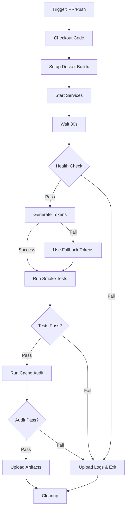

# GitHub Actions CI/CD Setup Guide

**Workflow:** `.github/workflows/smoke.yml`  
**Status:** ✅ Ready to Deploy  
**Triggers:** PR/push to main/develop, manual dispatch

---

## Overview

The smoke test workflow automatically validates provider and jobs functionality on every PR and push to main/develop branches. It includes:

- Docker Compose service startup
- Health checks
- Auth0 token generation
- Full smoke test suite (19 tests)
- Cache invalidation audit (6 tests)
- Artifact collection

---

## Required GitHub Secrets

Navigate to: **Settings → Secrets and variables → Actions → New repository secret**

### Auth0 Configuration (8 secrets)

#### 1. `AUTH0_DOMAIN`

**Value:** `cineca.eu.auth0.com`  
**Description:** Auth0 tenant domain

#### 2. `AUTH0_CLIENT_ID`

**Value:** Get from Auth0 Application settings  
**Description:** Machine-to-machine application client ID

#### 3. `AUTH0_CLIENT_SECRET`

**Value:** Get from Auth0 Application settings  
**Description:** Machine-to-machine application client secret

#### 4. `AUTH0_AUDIENCE`

**Value:** `api://cineca-agentic-platform`  
**Description:** API identifier for token audience

#### 5. `AUTH0_ADMIN_USERNAME`

**Value:** Admin user email (e.g., `admin@example.com`)  
**Description:** Test admin account username

#### 6. `AUTH0_ADMIN_PASSWORD`

**Value:** Admin user password  
**Description:** Test admin account password

#### 7. `AUTH0_USER_USERNAME`

**Value:** Regular user email (e.g., `user@example.com`)  
**Description:** Test regular user account username

#### 8. `AUTH0_USER_PASSWORD`

**Value:** Regular user password  
**Description:** Test regular user account password

---

### Fallback Tokens (2 secrets - Optional but Recommended)

#### 9. `SMOKE_TEST_ADMIN_TOKEN`

**Value:** Long-lived admin JWT token  
**Description:** Fallback if Auth0 token generation fails  
**Generate:**

```bash
./generate_auth0_tokens.sh
cat .env.tokens | grep ADMIN_TOKEN
```

#### 10. `SMOKE_TEST_USER_TOKEN`

**Value:** Long-lived user JWT token  
**Description:** Fallback if Auth0 token generation fails  
**Generate:**

```bash
./generate_auth0_tokens.sh
cat .env.tokens | grep USER_TOKEN
```

---

## Setup Instructions

### Step 1: Create Auth0 Test Accounts

1. Log into Auth0 Dashboard
2. Navigate to **User Management → Users**
3. Create two test users:
   - Admin user with `admin:full` role
   - Regular user with `user:basic` role
4. Save credentials for secrets

### Step 2: Get Auth0 Application Credentials

1. Navigate to **Applications → Applications**
2. Select your M2M application
3. Copy **Client ID** and **Client Secret**
4. Verify **Audience** matches `api://cineca-agentic-platform`

### Step 3: Add Secrets to GitHub

1. Go to repository **Settings → Secrets and variables → Actions**
2. Click **New repository secret**
3. Add all 10 secrets (8 required + 2 fallback)

### Step 4: Verify Workflow

1. Create a test PR or push to develop
2. Navigate to **Actions** tab
3. Watch the workflow run
4. Verify all steps pass ✅

---

## Workflow Execution Flow



---

## Token Generation Strategy

The workflow uses a two-tier token strategy:

### Tier 1: Fresh Token Generation (Preferred)

```yaml
- name: Generate Auth0 tokens
  run: |
    cat > .env.auth0 << EOF
    AUTH0_DOMAIN=${{ secrets.AUTH0_DOMAIN }}
    AUTH0_CLIENT_ID=${{ secrets.AUTH0_CLIENT_ID }}
    # ... other secrets
    EOF
    ./generate_auth0_tokens.sh
    source .env.tokens
```

**Advantages:**

- Fresh tokens (24-hour validity)
- Tests real Auth0 integration
- Detects token generation issues

### Tier 2: Fallback Tokens

```yaml
- name: Set fallback tokens
  if: failure()
  run: |
    echo "ADMIN_TOKEN=${{ secrets.SMOKE_TEST_ADMIN_TOKEN }}" >> .env.tokens
    echo "USER_TOKEN=${{ secrets.SMOKE_TEST_USER_TOKEN }}" >> .env.tokens
```

**Use Case:**

- Auth0 service outage
- Network issues
- Token generation script errors

---

## Troubleshooting

### Issue: Health Check Fails

**Error:**

```text
Health check failed after 30 seconds
```

**Solutions:**

1. Increase wait time in workflow (change `sleep 30` to `sleep 60`)
2. Check Docker resource limits
3. Verify Postgres/Redis startup time

### Issue: Token Generation Fails

**Error:**

```text
Failed to get admin token
```

**Solutions:**

1. Verify Auth0 secrets are correct
2. Check Auth0 user accounts exist
3. Ensure fallback tokens are set
4. Check Auth0 service status

### Issue: Smoke Tests Fail

**Error:**

```text
Test failed: Provider registration returned 500
```

**Solutions:**

1. Download workflow artifacts
2. Check `smoke_test_output.log`
3. Review Docker logs in artifacts
4. Run locally: `./smoke_test_providers_jobs.sh`

### Issue: Cache Audit Fails

**Error:**

```text
Cache invalidation test failed
```

**Solutions:**

1. Check Redis connection
2. Verify cache patterns in code
3. Run locally: `./cache_invalidation_audit.sh`
4. Review `cache_audit_output.log`

---

## Artifacts

The workflow uploads artifacts on every run (retained 7 days):

### `smoke_test_output.log`

- Complete smoke test output
- API request/response logs
- Error messages

### `cache_audit_output.log`

- Redis key monitoring
- Cache invalidation results
- Before/after comparisons

### `docker_logs.txt` (on failure only)

- All service logs (app, postgres, redis, memgraph, ollama)
- Startup errors
- Runtime exceptions

---

## Workflow Customization

### Change Test Timeout

```yaml
jobs:
  smoke-test:
    timeout-minutes: 15  # Change this
```

### Add More Tests

```yaml
- name: Run additional tests
  run: |
    source .env.tokens
    ./your_custom_test.sh
```

### Change Retention Period

```yaml
- name: Upload test results
  with:
    retention-days: 7  # Change this (1-90 days)
```

### Disable Cache Audit

```yaml
# Comment out or remove this step:
# - name: Run cache invalidation audit
#   run: ./cache_invalidation_audit.sh
```

---

## Security Best Practices

### ✅ DO

- Store credentials in GitHub Secrets
- Use short-lived tokens when possible
- Rotate tokens regularly
- Review workflow logs for sensitive data
- Limit secret access to necessary workflows

### ❌ DON'T

- Commit tokens to version control
- Echo secrets in workflow logs
- Share secrets across repositories
- Use production credentials for tests
- Store tokens in workflow files

---

## Monitoring

### GitHub Actions Dashboard

**View:** Repository → Actions tab

**Metrics:**

- Workflow run success rate
- Average execution time
- Failed step patterns
- Artifact sizes

### Key Performance Indicators

- **Success Rate:** Target >95%
- **Execution Time:** Target <10 minutes
- **Health Check:** Should pass in <30s
- **Smoke Tests:** All 19 tests should pass
- **Cache Audit:** All 6 tests should pass

---

## Manual Workflow Dispatch

### Trigger Manually

1. Go to **Actions → Provider & Jobs Smoke Tests**
2. Click **Run workflow**
3. Select branch (main/develop)
4. Click **Run workflow**

### Use Cases

- Test after configuration change
- Verify secret updates
- Debug workflow issues
- Pre-merge validation

---

## Maintenance

### Weekly Tasks

- [ ] Review workflow run history
- [ ] Check for failed runs
- [ ] Verify artifact retention
- [ ] Monitor execution time trends

### Monthly Tasks

- [ ] Rotate Auth0 test account passwords
- [ ] Update fallback tokens
- [ ] Review and update timeout settings
- [ ] Clean up old artifacts

### Quarterly Tasks

- [ ] Audit GitHub Secrets access
- [ ] Review test coverage
- [ ] Update dependencies (e.g., actions versions)
- [ ] Optimize workflow performance

---

## Local Testing

Before pushing to GitHub, test the workflow locally:

### Step 1: Set Up Secrets

```bash
# Create .env.auth0
cp .env.auth0.example .env.auth0
# Edit and add your credentials
```

### Step 2: Start Services

```bash
docker compose up -d --build
```

### Step 3: Wait for Health

```bash
sleep 30
curl http://localhost:8000/v1/health/ready
```

### Step 4: Generate Tokens

```bash
./generate_auth0_tokens.sh
source .env.tokens
```

### Step 5: Run Tests

```bash
./smoke_test_providers_jobs.sh
./cache_invalidation_audit.sh
```

### Step 6: Clean Up

```bash
docker compose down -v
```

---

## Support

**Documentation:**

- Workflow: `.github/workflows/smoke.yml`
- Token Script: `generate_auth0_tokens.sh`
- Smoke Tests: `smoke_test_providers_jobs.sh`
- Cache Audit: `cache_invalidation_audit.sh`
- Polish Summary: `docs/POSTGRES_PROVIDERS_POLISH_COMPLETE.md`

**Quick Links:**

- [GitHub Actions Documentation](https://docs.github.com/en/actions)
- [Auth0 OAuth2 Password Grant](https://auth0.com/docs/get-started/authentication-and-authorization-flow/resource-owner-password-flow)
- [Docker Compose CI/CD](https://docs.docker.com/compose/ci-cd/)

---

**🚀 Ready to Deploy - Add Secrets and Run Your First Workflow** 🚀
